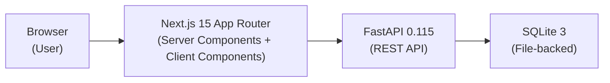
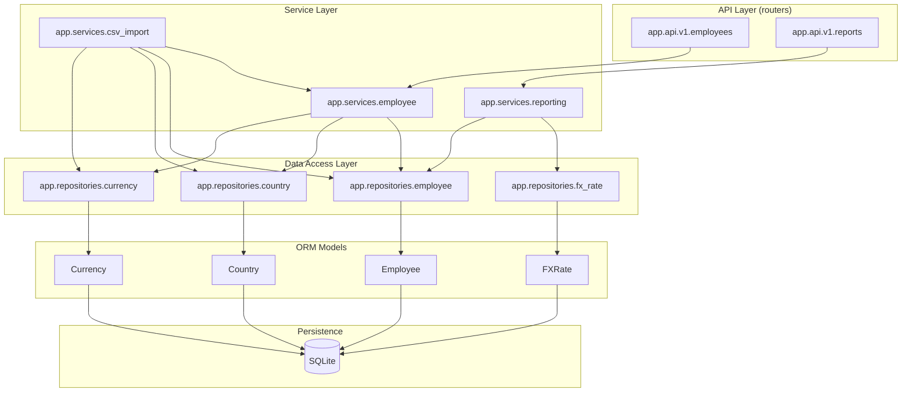
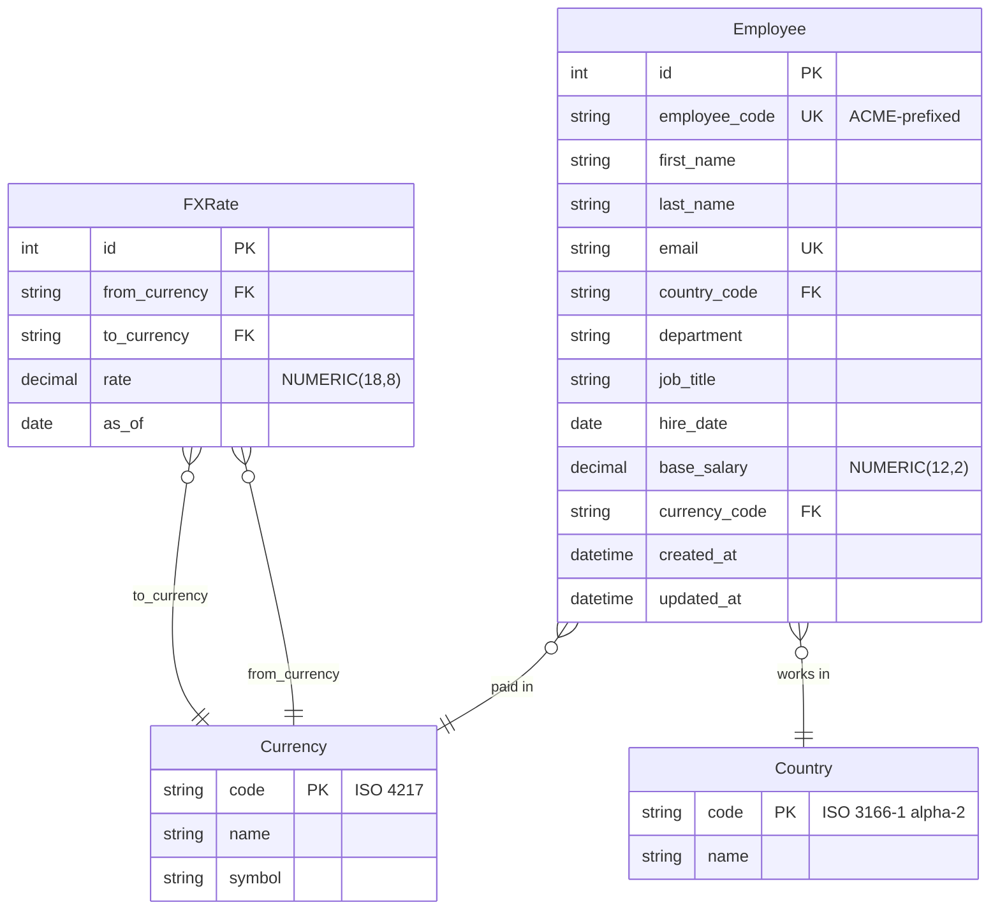
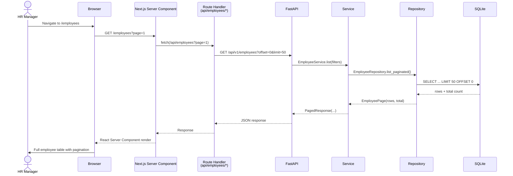

# Architecture — Salary Management System

## Layered Architecture

The system follows a strict layered architecture where each layer communicates only with the layer directly below it. **Router** (HTTP concerns) → **Service** (business logic) → **Repository** (data access) → **ORM** (SQLAlchemy models) → **SQLite** (persistence). The frontend mirrors this with Server Components (data fetching) → Client Components (interaction). This separation keeps every layer independently testable and makes the database a swappable implementation detail.

### 1. High-level Component Diagram

### 2. Backend Layer Diagram

### 3. Entity-Relationship Diagram

### 4. Request Flow Sequence Diagram

## Why Layered Architecture?

Each layer has a single responsibility: routers handle HTTP (serialisation, status codes), services handle business rules (validation, FX conversion, uniqueness), repositories handle data access patterns (pagination, filtering, subqueries). This means the SQLite → Postgres swap is a repository-layer change only, routes stay thin enough to test without HTTP clients, and services are pure enough for fast pytest loops. The frontend Server Component → Route Handler pattern (DAL) keeps API secrets server-side and avoids CORS entirely.
